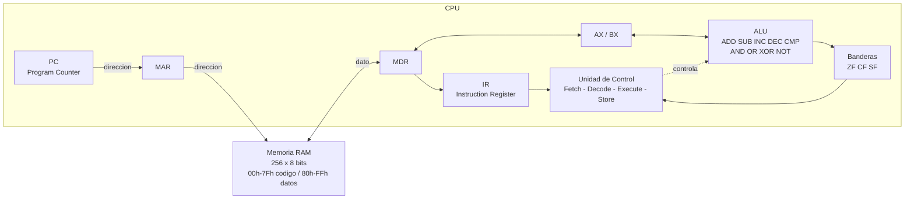
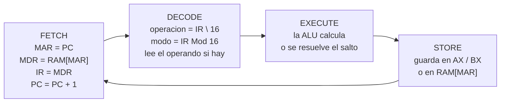

# Simulador de CPU de 8 bits (von Neumann)

Simulador de un CPU de 8 bits con memoria principal de 256 bytes, hecho en **Microsoft Excel con macros VBA**.
Muestra el ciclo de instrucción completo (**Fetch → Decode → Execute → Store**) paso a paso o en modo continuo.

- **Materia:** Arquitectura de Computadoras (SIS-131), Primer Parcial
- **Universidad:** Universidad Católica Boliviana "San Pablo", Santa Cruz

## Arquitectura (diagrama Mermaid)



### Ciclo de instrucción



### Módulos del código (carpeta `src`)

| Módulo | Qué hace |
|---|---|
| `modHoja` | Arma la hoja: memoria 16x16, registros, banderas, inspector |
| `modRegistros` | Leer / escribir registros y banderas, RESET |
| `modMemoria` | `LeerMemoria` y `EscribirMemoria` (Read / Write usando MAR y MDR) |
| `modALU` | La ALU: hace la operación y actualiza ZF, CF, SF |
| `modCPU` | Unidad de control: las 4 fases del ciclo |
| `modControles` | Botones STEP, RUN, PAUSE, RESET y LOAD PROGRAM |
| `modLog` | Resaltado en naranja y log de micro-operaciones |
| `modProgramas` | Carga de programas en memoria (demo y prueba) |
| `HojaCPU.vba` | Código de la hoja: el inspector de memoria |

> Todo acceso a memoria pasa por `LeerMemoria` / `EscribirMemoria`. En el Parcial 2 ahí se conectará el Bus del Sistema sin tocar el resto del CPU.

## Mapa de memoria

La memoria principal tiene **256 posiciones de 8 bits** (00h – FFh), divididas en dos segmentos lógicos:

| Rango       | Segmento | Uso                                          |
|-------------|----------|----------------------------------------------|
| `00h – 7Fh` | Código   | Instrucciones del programa (128 bytes)       |
| `80h – FFh` | Datos    | Variables, arreglos y resultados (128 bytes) |

## Tabla ISA

### Formato del opcode

Cada opcode ocupa **1 byte** (2 dígitos hexadecimales):

- **Nibble alto** → operación (1 = MOV, 3 = ADD, 4 = SUB, ...).
- **Nibble bajo** → modo / registros involucrados.

| Nibble bajo | Modo      | Operandos | Bytes |
|-------------|-----------|-----------|-------|
| `0`         | Inmediato | `AX, imm` | 2     |
| `1`         | Inmediato | `BX, imm` | 2     |
| `2`         | Registro  | `AX, BX`  | 1     |
| `3`         | Registro  | `BX, AX`  | 1     |

La Unidad de Control decodifica con: `operación = opcode \ 16` y `modo = opcode Mod 16`.

### Repertorio de instrucciones

| Mnemónico         | Opcode | Bytes | Descripción                        | Banderas     |
|-------------------|--------|-------|------------------------------------|--------------|
| `HLT`             | `00`   | 1     | Detiene el reloj del CPU           | —            |
| `MOV AX, imm`     | `10`   | 2     | AX ← imm                           | —            |
| `MOV BX, imm`     | `11`   | 2     | BX ← imm                           | —            |
| `MOV AX, BX`      | `12`   | 1     | AX ← BX                            | —            |
| `MOV BX, AX`      | `13`   | 1     | BX ← AX                            | —            |
| `LOAD AX, [dir]`  | `20`   | 2     | AX ← RAM[dir]                      | —            |
| `LOAD BX, [dir]`  | `21`   | 2     | BX ← RAM[dir]                      | —            |
| `STORE [dir], AX` | `22`   | 2     | RAM[dir] ← AX                      | —            |
| `STORE [dir], BX` | `23`   | 2     | RAM[dir] ← BX                      | —            |
| `ADD AX, imm`     | `30`   | 2     | AX ← AX + imm                      | ZF, CF, SF   |
| `ADD BX, imm`     | `31`   | 2     | BX ← BX + imm                      | ZF, CF, SF   |
| `ADD AX, BX`      | `32`   | 1     | AX ← AX + BX                       | ZF, CF, SF   |
| `ADD BX, AX`      | `33`   | 1     | BX ← BX + AX                       | ZF, CF, SF   |
| `SUB AX, imm`     | `40`   | 2     | AX ← AX − imm                      | ZF, CF, SF   |
| `SUB BX, imm`     | `41`   | 2     | BX ← BX − imm                      | ZF, CF, SF   |
| `SUB AX, BX`      | `42`   | 1     | AX ← AX − BX                       | ZF, CF, SF   |
| `SUB BX, AX`      | `43`   | 1     | BX ← BX − AX                       | ZF, CF, SF   |
| `INC AX`          | `50`   | 1     | AX ← AX + 1                        | ZF, CF, SF   |
| `INC BX`          | `51`   | 1     | BX ← BX + 1                        | ZF, CF, SF   |
| `DEC AX`          | `52`   | 1     | AX ← AX − 1                        | ZF, CF, SF   |
| `DEC BX`          | `53`   | 1     | BX ← BX − 1                        | ZF, CF, SF   |
| `CMP AX, imm`     | `60`   | 2     | AX − imm (solo actualiza banderas) | ZF, CF, SF   |
| `CMP BX, imm`     | `61`   | 2     | BX − imm (solo actualiza banderas) | ZF, CF, SF   |
| `CMP AX, BX`      | `62`   | 1     | AX − BX (solo actualiza banderas)  | ZF, CF, SF   |
| `CMP BX, AX`      | `63`   | 1     | BX − AX (solo actualiza banderas)  | ZF, CF, SF   |
| `AND AX, imm`     | `70`   | 2     | AX ← AX AND imm                    | ZF, SF, CF=0 |
| `AND BX, imm`     | `71`   | 2     | BX ← BX AND imm                    | ZF, SF, CF=0 |
| `AND AX, BX`      | `72`   | 1     | AX ← AX AND BX                     | ZF, SF, CF=0 |
| `AND BX, AX`      | `73`   | 1     | BX ← BX AND AX                     | ZF, SF, CF=0 |
| `OR AX, imm`      | `80`   | 2     | AX ← AX OR imm                     | ZF, SF, CF=0 |
| `OR BX, imm`      | `81`   | 2     | BX ← BX OR imm                     | ZF, SF, CF=0 |
| `OR AX, BX`       | `82`   | 1     | AX ← AX OR BX                      | ZF, SF, CF=0 |
| `OR BX, AX`       | `83`   | 1     | BX ← BX OR AX                      | ZF, SF, CF=0 |
| `XOR AX, imm`     | `90`   | 2     | AX ← AX XOR imm                    | ZF, SF, CF=0 |
| `XOR BX, imm`     | `91`   | 2     | BX ← BX XOR imm                    | ZF, SF, CF=0 |
| `XOR AX, BX`      | `92`   | 1     | AX ← AX XOR BX                     | ZF, SF, CF=0 |
| `XOR BX, AX`      | `93`   | 1     | BX ← BX XOR AX                     | ZF, SF, CF=0 |
| `NOT AX`          | `A0`   | 1     | AX ← NOT AX                        | ZF, SF       |
| `NOT BX`          | `A1`   | 1     | BX ← NOT BX                        | ZF, SF       |
| `JMP dir`         | `F0`   | 2     | PC ← dir                           | —            |
| `JZ dir`          | `F1`   | 2     | Si ZF = 1 → PC ← dir               | —            |
| `JNZ dir`         | `F2`   | 2     | Si ZF = 0 → PC ← dir               | —            |

### Banderas (registro de estado)

| Bandera | Nombre     | Se activa (1) cuando...                                                  |
|---------|------------|--------------------------------------------------------------------------|
| `ZF`    | Zero Flag  | El resultado de la última operación es `00h`                             |
| `CF`    | Carry Flag | Hay acarreo en la suma (resultado > FFh) o préstamo en la resta (a < b)  |
| `SF`    | Sign Flag  | El bit más significativo (bit 7) del resultado es 1                      |

> **Decisión de diseño:** `HLT` se codifica como `00h`. Si el programa se sale hacia memoria vacía, el CPU se detiene en lugar de ejecutar datos basura.

## Manual de usuario

### Abrir el simulador
1. Abrir `SimuladorCPU.xlsm`.
2. Si aparece la barra amarilla, hacer clic en **Habilitar contenido** (para que funcionen las macros).
3. Solo la primera vez (o si la hoja se desordena): `Alt + F8` → **PrepararHoja** y luego `Alt + F8` → **CrearBotones**.

### Partes de la pantalla
- **Memoria RAM (C5:R20):** fila = primer dígito hex de la dirección, columna = segundo dígito. Ej: la dirección `82h` está en la fila `80`, columna `2`. Azul = código, verde = datos.
- **Registros:** PC, IR, MAR, MDR, AX, BX en hexadecimal, binario y decimal.
- **Banderas:** ZF, CF, SF.
- **Inspector:** al hacer clic en una celda de la memoria muestra su dirección y su valor en hex, binario y decimal.
- **Ciclo de instrucción:** la fase que se acaba de ejecutar (con su color) y la instrucción actual.
- **Log de micro-operaciones:** debajo de la memoria, el paso más nuevo arriba.
- Lo que cambia en cada fase se pinta de **naranja**.

### Botones
| Botón | Qué hace |
|---|---|
| **LOAD PROGRAM** | Carga el programa demo (multiplicación 7 x 5) y reinicia el CPU |
| **STEP** | Ejecuta **una fase** del ciclo (Fetch, Decode, Execute o Store) |
| **RUN** | Ejecuta solo, fase por fase, hasta llegar a `HLT` |
| **PAUSE** | Detiene el RUN (se puede seguir con STEP o RUN) |
| **RESET** | Pone registros, banderas y PC en 0 (la memoria no se borra) |
| **Delay (ms)** | Celda `U2`: tiempo de espera entre fases en modo RUN |

### Paso a paso para probar
1. Clic en **LOAD PROGRAM**.
2. Clic en **STEP** varias veces y ver cómo cambian los registros y el log.
3. Clic en **RUN** para que termine solo.
4. Al final la celda `82h` tiene `23` (35 en decimal = 7 x 5).

### Modificar la memoria a mano
Se puede escribir un valor hexadecimal directamente en cualquier celda de la memoria (ej: `0A`).
Ejemplo: cambiar la celda `81h` de `05` a `03`, presionar **RESET** y **RUN** → el resultado en `82h` será `15` (21 = 7 x 3).

Para escribir otro programa: poner los bytes desde la dirección `00`, presionar **RESET** y luego **STEP** o **RUN**.

## Programa demostrativo y traza

### Multiplicación por sumas sucesivas
Calcula `RAM[82h] = RAM[80h] x RAM[81h]` sumando el multiplicando tantas veces como indica el multiplicador.
Usa un **bucle**, un **salto condicional** (`JZ`), un **salto incondicional** (`JMP`) y **guarda en memoria**.

| Dir | Bytes | Instrucción | Comentario |
|---|---|---|---|
| `00` | `10 00` | `MOV AX, 00` | AX = 0 |
| `02` | `21 80` | `LOAD BX, [80]` | BX = multiplicando (7) |
| `04` | `22 82` | `STORE [82], AX` | resultado = 0 |
| `06` | `20 81` | `LOAD AX, [81]` | **bucle:** AX = contador |
| `08` | `60 00` | `CMP AX, 00` | ¿contador = 0? |
| `0A` | `F1 16` | `JZ 16` | si ZF = 1 → fin |
| `0C` | `52` | `DEC AX` | contador - 1 |
| `0D` | `22 81` | `STORE [81], AX` | guarda el contador |
| `0F` | `20 82` | `LOAD AX, [82]` | AX = resultado parcial |
| `11` | `32` | `ADD AX, BX` | resultado + multiplicando |
| `12` | `22 82` | `STORE [82], AX` | guarda el resultado |
| `14` | `F0 06` | `JMP 06` | vuelve al bucle |
| `16` | `00` | `HLT` | fin |

Datos iniciales: `RAM[80h] = 07`, `RAM[81h] = 05`, `RAM[82h] = 00`.

### Traza de la primera vuelta (instrucción por instrucción)

| # | PC | Instrucción | AX | BX | ZF | CF | SF | RAM[81] | RAM[82] |
|---|---|---|---|---|---|---|---|---|---|
| 1 | `00` | `MOV AX, 00` | 00 | 00 | 0 | 0 | 0 | 05 | 00 |
| 2 | `02` | `LOAD BX, [80]` | 00 | 07 | 0 | 0 | 0 | 05 | 00 |
| 3 | `04` | `STORE [82], AX` | 00 | 07 | 0 | 0 | 0 | 05 | 00 |
| 4 | `06` | `LOAD AX, [81]` | 05 | 07 | 0 | 0 | 0 | 05 | 00 |
| 5 | `08` | `CMP AX, 00` → 5 − 0 = 5 | 05 | 07 | 0 | 0 | 0 | 05 | 00 |
| 6 | `0A` | `JZ 16` → ZF = 0, no salta | 05 | 07 | 0 | 0 | 0 | 05 | 00 |
| 7 | `0C` | `DEC AX` → 5 − 1 = 4 | 04 | 07 | 0 | 0 | 0 | 05 | 00 |
| 8 | `0D` | `STORE [81], AX` | 04 | 07 | 0 | 0 | 0 | **04** | 00 |
| 9 | `0F` | `LOAD AX, [82]` | 00 | 07 | 0 | 0 | 0 | 04 | 00 |
| 10 | `11` | `ADD AX, BX` → 0 + 7 = 7 | 07 | 07 | 0 | 0 | 0 | 04 | 00 |
| 11 | `12` | `STORE [82], AX` | 07 | 07 | 0 | 0 | 0 | 04 | **07** |
| 12 | `14` | `JMP 06` → PC = 06 | 07 | 07 | 0 | 0 | 0 | 04 | 07 |

### Resumen de todas las vueltas

| Vuelta | Contador RAM[81] | Suma | Resultado RAM[82] |
|---|---|---|---|
| 1 | 05 → 04 | 0 + 7 | `07` (7) |
| 2 | 04 → 03 | 7 + 7 | `0E` (14) |
| 3 | 03 → 02 | 14 + 7 | `15` (21) |
| 4 | 02 → 01 | 21 + 7 | `1C` (28) |
| 5 | 01 → 00 | 28 + 7 | `23` (35) |
| fin | `LOAD AX, [81]` → AX = 00, `CMP AX, 00` → **ZF = 1**, `JZ 16` salta, `HLT` | | |

**Resultado final:** `RAM[82h] = 23h = 35 = 7 x 5`, AX = 00, BX = 07, ZF = 1, PC = 17h.
En total se ejecutan 52 instrucciones.

### Ejemplo del log (primera instrucción)
```
[Paso 04] STORE: AX <- 00
[Paso 03] EXECUTE: dato = 00
[Paso 02] DECODE: IR=10 -> MOV AX, 00  (operando: MAR=01, MDR=00)
[Paso 01] FETCH: MAR=00, MDR=10 -> IR=10, PC=01
```